# 🗺️ 06-WIREFRAME_IDEAS.md: Arquitetura Visual e Esboços

# 📑 1. Objetivo da Arquitetura
Este documento consolida a arquitetura visual, diagramas de casos de uso e esboços estruturais da plataforma **StatPoker** (Gestão de Clubes de Poker — "Seu clube inteiro, numa só mesa"). Ele serve como referência para José (Frontend) e Ana (Backend), garantindo alinhamento total entre a experiência visual do usuário e os contratos de dados definidos no `SCHEMA.md`.

# 👥 2. Diagrama de Caso de Uso (DCU)

```mermaid
flowchart TD
    subgraph Atores
        ADM[👑 Administrador / Dono]
        FLOOR[⏱️ Floor / Diretor Torneio]
        DEALER[♠️ Dealer / Operador Cash]
        CAIXA[💵 Caixa / Barman]
        PLAYER[📱 Jogador / GameID]
        VIS[🌐 Visitante / Lead Comercial]
    end
    
    subgraph "Landing Page Pública"
        UC1[Visualizar Proposta de Valor e Módulos]
        UC2[Consultar Tabela de Planos Start/Pro/Enterprise]
        UC3[Enviar Mensagem Fale Conosco / Migração]
    end

    subgraph "Autenticação & Segurança"
        UC4[Efetuar Login Usuário + Senha]
        UC5[Validar Código OTP 2FA]
    end

    subgraph "Dashboard Operacional do Clube"
        UC6[Monitorar KPIs e Gráficos de Faturamento/Rake]
        UC7[Gerenciar Torneios, Blinds e Relógio na TV]
        UC8[Controlar Mesas de Cash Game e Fichário]
        UC9[Lançar Comandas de Bar com Baixa de Estoque]
        UC10[Conciliar Caixas e Transações PW PIX]
        UC11[Gerenciar Ranking, Satélites e Jackpot]
        UC12[Consultar Leaderboard e Saldo no GameID]
    end
    
    VIS --> UC1
    VIS --> UC2
    VIS --> UC3
    VIS --> UC4

    ADM --> UC4
    ADM --> UC5
    ADM --> UC6
    ADM --> UC10
    ADM --> UC11

    FLOOR --> UC4
    FLOOR --> UC5
    FLOOR --> UC7
    
    DEALER --> UC4
    DEALER --> UC8

    CAIXA --> UC4
    CAIXA --> UC5
    CAIXA --> UC9
    CAIXA --> UC10

    PLAYER --> UC12
```



---

# 🏠 3. Wireframe: Landing Page Comercial

```text
+-----------------------------------------------------------------------------------+
| [♠ StatPoker ♣]     Quem Somos   Tudo na Mesa   Planos   Fale Conosco    [ Entrar ]|
+-----------------------------------------------------------------------------------+
|                                                                                   |
|                                STAT POKER                                         |
|    Seu clube inteiro, numa só mesa. Torneios, cash game, bar, financeiro,        |
|          ranking e o app do jogador — 100% online, com banco exclusivo e 2FA.     |
|                                                                                   |
|                   [ Começar Agora ]      [ Conhecer o Sistema ]                   |
|                                                                                   |
+-----------------------------------------------------------------------------------+
| >>> TICKER: Torneios ♦ Cash Game ♥ Bar & Restaurante ♦ Financeiro ♦ Ranking ♦ >>> |
+-----------------------------------------------------------------------------------+
|  [📢 Destaque]  Semana do Clube: migração gratuita                                |
|  Trazemos todo o seu histórico sem custo e sem parar a operação.                 |
+-----------------------------------------------------------------------------------+
|  QUEM SOMOS                                                                       |
|  Atendemos globalmente a comunidade do poker.     [ 3 Produtos ]  [ 100% Online ] |
|  Tecnologia + Vivência de salão.                  [ 1 Banco Exclusivo por Clube ] |
+-----------------------------------------------------------------------------------+
|  TUDO NA MESA (Módulos)                                                           |
|  +------------------+  +------------------+  +------------------+                 |
|  | 🏆 Torneios      |  | 💰 Cash Game     |  | 🍺 Bar & Rest.   |                 |
|  | Blinds, relógio  |  | Fichário real,   |  | Comandas na mesa |                 |
|  | TV e redraw      |  | fila e tempo app |  | e baixa estoque  |                 |
|  +------------------+  +------------------+  +------------------+                 |
|  +------------------+  +------------------+  +------------------+                 |
|  | 📊 Financeiro    |  | 🥇 Engajamento   |  | 📱 GameID        |                 |
|  | Centro de custos |  | Ranking próprio, |  | App do jogador:  |                 |
|  | e PW PIX caixa   |  | tickets, jackpot |  | auto-cadastro PIX|                 |
|  +------------------+  +------------------+  +------------------+                 |
+-----------------------------------------------------------------------------------+
|  ESCOLHA SEU JOGO (Planos)                                                        |
|  +-------------------+  +-------------------+  +-------------------+              |
|  |      START        |  |  ★ PRO (Destaque) |  |    ENTERPRISE     |              |
|  |    R$ 297/mês     |  |    R$ 597/mês     |  |   Sob Consulta    |              |
|  | Torneios + Cash   |  | Tudo Start + Bar, |  | Tudo Pro + GameID |              |
|  | 3 logins equipe   |  | PIX, Jackpot,     |  | White-label, multi|              |
|  | Relógio nas TVs   |  | Logins ilimitados |  | unidades e gerente|              |
|  | [ Assinar Start ] |  | [ Assinar Pro ]   |  | [ Falar Vendas ]  |              |
|  +-------------------+  +-------------------+  +-------------------+              |
+-----------------------------------------------------------------------------------+
|  FALE CONOSCO                                                                     |
|  [ Nome Completo                     ]   [ E-mail ou WhatsApp                    ]|
|  [ Mensagem: Conte sobre seu clube (mesas, torneios/semana)...                  ] |
|                                   [ Enviar Mensagem ]                             |
+-----------------------------------------------------------------------------------+
|  FOOTER: O clube inteiro, sempre na mesa.                                         |
|  contato@statpoker.com  ·  Suporte 7 dias  ·  © 2026 StatPoker                   |
+-----------------------------------------------------------------------------------+
```

---

# 🔐 4. Wireframe: Autenticação e 2FA (Modais)

```text
+------------------------------------------+    +------------------------------------------+
|             [♠ StatPoker ♣]              |    |             [♠ StatPoker ♣]              |
|   Clube Royal Flush — acesso restrito    |    |   Clube Royal Flush — acesso restrito    |
|                                          |    |                                          |
|  Usuário                                 |    |  Verificação em duas etapas              |
|  [ seu.usuario                         ] |    |  Digite o código de 6 dígitos do app:    |
|  Senha                                   |    |                                          |
|  [ ••••••••••                          ] |    |  [ 5 ] [ 9 ] [ 2 ] [ 8 ] [ 1 ] [ 4 ]     |
|                                          |    |                                          |
|              [  Entrar  ]                |    |             [ Confirmar ]                |
|                                          |    |                                          |
|        Esqueci minha senha               |    |             ← Voltar                     |
|  🔒 Conexão segura · banco exclusivo     |    |  🔒 Conexão segura · banco exclusivo     |
|  ← Voltar ao site                        |    +------------------------------------------+
+------------------------------------------+
```

---

# 📊 5. Wireframe: Dashboard Operacional SPA

```text
+-------------------------------------------------------------------------------------------------+
| [♠ StatPoker ♣]             | [☰] HOME                               |  [VI] Victor (Admin) [⏻] |
+-----------------------------+-------------------------------------------------------------------+
| OPERAÇÃO                    | Bem-vindo, Victor 👋                                [ 7 dias ▾ ]  |
|  🏠 Home (Ativo)            | Domingo, 13 de setembro de 2026 · Clube Royal Flush  [ 💬 Suporte ]|
|  🏆 Torneios                +-------------------------------------------------------------------+
|  💰 Cash Game               | [ FATURAMENTO ]   [ RAKE TOTAL ]   [ JOGADORES ]    [ DESPESAS ]  |
|  🍺 Bar & Restaurante       |   R$ 86.320         R$ 14.780           214          R$ 22.140    |
|                             |   ▲ +12% sem.       ▲ +8% sem.       31 novos reg.   ▼ -4%        |
| CADASTROS                   +-------------------------------------------------------------------+
|  👤 Jogadores               | [ Gráfico de Faturamento ]            | [ Composição de Rake ]    |
|  👥 Funcionários            | (Seg a Dom - R$ 86k consolidado)      | Torneios: 62%             |
|                             |                                       | Cash Game: 38%            |
| ENGAJAMENTO                 +-------------------------------------------------------------------+
|  🥇 Ranking                 | [ Torneios em Andamento ]             | [ Mesas de Cash Game ]    |
|  🎟️ Tickets                 | • Sunday Warmup - Nível 8 (Blinds)    | • Mesa 01: NLH 5/5 (8/9)  |
|  💰 Jackpot                 | • High Roller Quinta - Final Table    | • Mesa 02: PLO 5/10 (6/9) |
|  📣 Marketing               +-------------------------------------------------------------------+
|                             | [ Movimentação Recente de Caixas ]                                |
| GESTÃO                      | • Buy-in #1042 - R$ 350,00 (PIX) - Caixa 01                       |
|  📊 Financeiro              | • Comanda #89 - R$ 68,00 (Dinheiro) - Bar Balcão                  |
|  📄 Relatórios              | • Saque Fichário #411 - R$ 1.200,00 (PIX) - Caixa Central         |
+-----------------------------+-------------------------------------------------------------------+
```

✅ Arquivo 06-WIREFRAME_IDEAS.md atualizado com os fluxos e wireframes do STATPOKER!